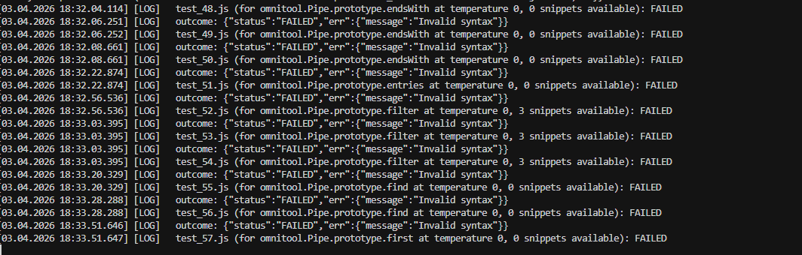
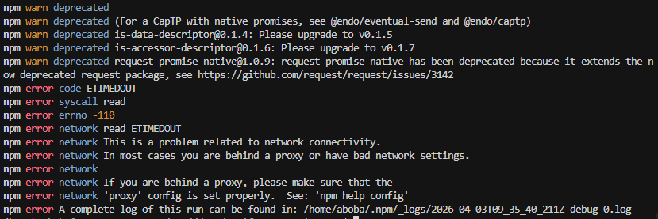
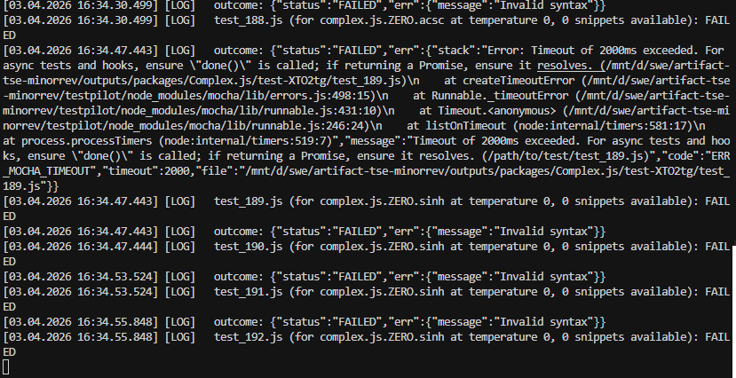

# About Logs
So, the average logs of the <i>correctly</i> running testpilot could be seen in here: 
There is not much to add to it.

Now, more important ones:
There were some repos that did not have had any direct instructions regarding the building or testing them, and standard behavior of the testpilot was not working properly on them, showing the following errors: 
Thus, we have decided to skip it, as fixing it would involve either overengineering the replication scripts, or building all the apps by a person, and since we are constrained by time, we can't afford doing both.

There are also some timeouts errors from mocha: 
These are complicated, as there is a tradeoff between increasing the time limit of mocha validator and <i>possibly</i> get a passing result, or spending much more time waiting for an incorrectly written test to not pass the testing.